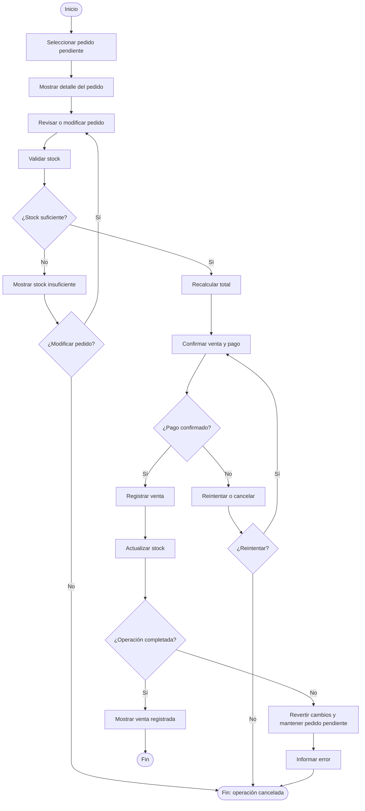

# CU-003 - Registrar venta

## Objetivo

Representar el flujo principal de registro de una venta en Khanauky, incluyendo validación de stock, pago, actualización de existencias y excepciones.

## Flujo principal

1. El vendedor selecciona un pedido pendiente.
2. El sistema muestra el detalle del pedido.
3. El vendedor revisa productos y cantidades.
4. Si es necesario, modifica el pedido.
5. El sistema valida el stock disponible.
6. El sistema recalcula el total.
7. El vendedor confirma la venta.
8. El vendedor registra o confirma el pago.
9. El sistema registra la venta.
10. El sistema actualiza el stock.
11. El sistema muestra la venta registrada.
12. Fin.

## Excepciones

### E1 - Stock insuficiente

Si algún producto supera la cantidad disponible, el sistema informa el problema y el vendedor debe modificar la cantidad, eliminar el producto o cancelar la operación.

### E2 - Pago no confirmado

Si el pago no puede confirmarse, el vendedor puede reintentar o cancelar. La venta no debe registrarse mientras el pago no haya sido confirmado según las reglas definidas para el proyecto.

### E3 - Error durante el registro

Si ocurre un error al registrar la venta o actualizar el stock, la operación debe cancelarse y conservarse el estado consistente anterior.

### C1 - Compensación

Si no se completa correctamente el registro de la venta junto con la actualización del stock, los cambios realizados deben revertirse para evitar una venta sin descuento de existencias o un descuento de stock sin venta registrada.

## Diagrama Mermaid

