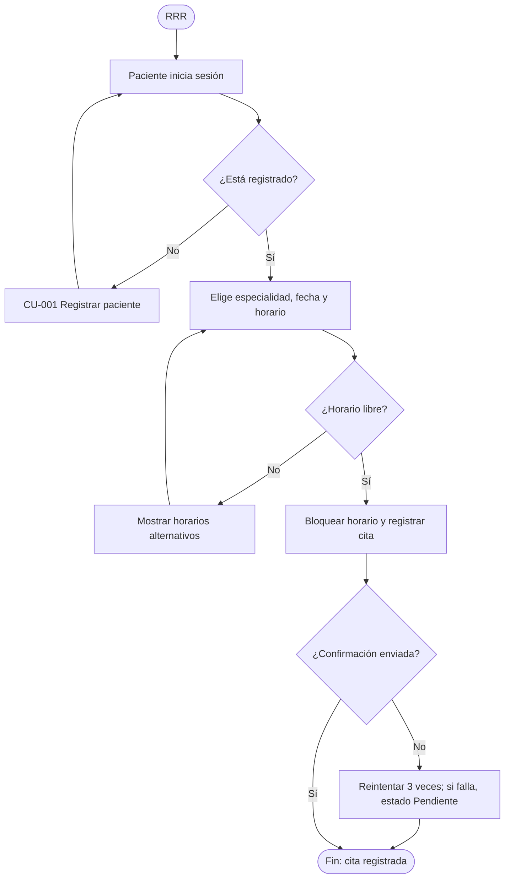

```mermaid
flowchart TD
A([RRR]) --> B[Paciente inicia sesión]
B --> C{¿Está registrado?}
C -- No --> R[CU-001 Registrar paciente] --> B
C -- Sí --> D[Elige especialidad, fecha y horario]
D --> E{¿Horario libre?}
E -- No --> F[Mostrar horarios alternativos] --> D
E -- Sí --> G[Bloquear horario y registrar cita]
G --> H{¿Confirmación enviada?}
H -- No --> I[Reintentar 3 veces; si falla, estado Pendiente] --> J
H -- Sí --> J([Fin: cita registrada])
```
